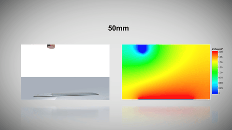
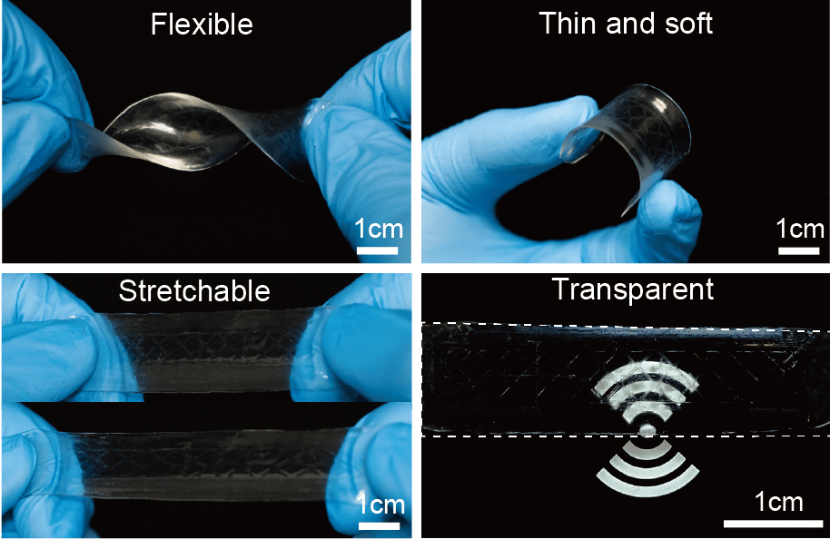
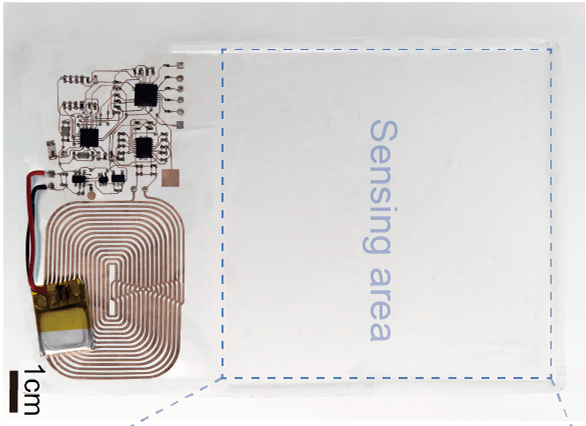
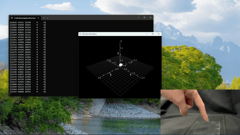
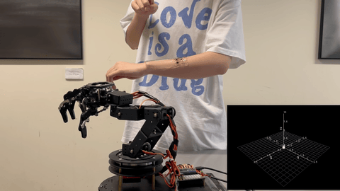

<div align="center">
<h1> Mormyroidea-inspired electronic skin for active non-contact three-dimensional tracking and sensing </h1>
</div>

This is the source code for paper "Mormyroidea-inspired electronic skin for active non-contact three-dimensional tracking and sensing" published in ***Nature Communications***.

## 0. Introduction
The concept of this project is based on the principle that an electric field can be disturbed by a conductor, thereby causing changes in voltage at the receiving end. 

<style>
.image-class {
    width: 60%;
    height: auto; /* 保持原始宽高比 */
    display: block; /* 确保图片独立显示 */
    margin: 0 auto; /* 居中对齐 */
}
</style>


By using hydrogel and silicone rubber to fabricate the transmitting and receiving electrodes, we can create flexible, stretchable and transparent sensors. 
<style>
  .image-container {
    display: flex;
    justify-content: center;
  }

  .image-container img {
    width: 30%; /* 调整宽度以适应并排显示 */
    height: auto;
    margin: 5px; /* 添加间距 */
  }
</style>

<div class="image-container">
  
  
</div>
Integrating multiple sensors enables non-contact 3D sensing. This device can serve as an input device for controlling three-dimensional objects in computers (such as playing 3D games or performing 3D modeling), control machines to move in three-dimensional space, and also endow robots with the ability to perceive their surrounding environment. The device has low power consumption and can directly connect to smartphones and computers equipped with Bluetooth.

<div class="image-container">
  
  
  
</div>

## 1. Android app code
### 1.1. System requirement
Android >= 10.0, <12.0
Bluetooth >= 4.0
### 1.2. Installation
Go to Android_app/app/release, download the compiled APK file to an android phone and open it to install.

### 1.3. Compiler Environment
Android Studio BumBleBee 2021.1.1 Patch 2

### 1.4. Dependencies
MPAndroidChart: v3.1.0
appcompat: 1.3.1
baseble: 2.0.5
constraintlayout: 2.1.0
espresso-core: 3.4.0
junit: 1.1.3
material: 1.4.0

### 1.5. Test
This app has tested on

- Redmi Note 9T, MIUI Global 12.5.6(Android 11)
- Xiaomi Mix 2s, MIUI 12.5.1(Android 10)

## 2. Hardware
### 2.1. Hardware Schematic
The hardware schematic is in the doc/Schematic.png.

### 2.2 Firmware
The firmware is in the folder firmware.
Compiled with
- Code Composer Studio 12.8.0.00012matlab
- Simplelink cc2640r2 sdk 1.40.00.45
- XDCTools 3.62.00.08
- Compiler version: TI v20.2.7.LTS

## 3. Python Code
### 3.1 Environment
- Python 3.11
- Install requirements
```bash
cd Python_code
pip install -r requirements.txt
```
### 3.2 Usage
This package includes two demos. `robot_arm.py` receives control signals from Eskin via Bluetooth, converts spatial coordinates into rotation angles for each joint of a six-axis robotic arm, and then sends the control signals through a serial port to the robotic arm. `robot_arm_PID.py` requires attaching Eskin to the robotic arm. Eskin collects the spatial position of the target relative to the robotic arm, converts it into control signals for the robotic arm, and controls the arm to move to the target's location while continuously tracking the target's movement trajectory.
```bash
python3 robot_arm.py
```

## Cite
If you find this useful, cite this paper below
```
Zhou, J., Jian, L., Huiling, J., Kuanming, Y. et al. Mormyroidea-inspired electronic skin for active non-contact three-dimensional tracking and sensing. Nat Commun (2024). 
```
Thank you !!